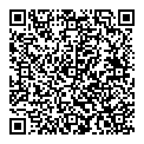

# MyLinks

A serverless social cards sharing web app 

## Social card

It's like "contact address" with social media usernames (Snapchat, Facebook, Twitter, Instagram, Phone, etc.)

It can be used to share contacts in less of a minute with anyone using a QR Code.

It is Server 'less (emphasised): It does not send data from users browsers anywhere; Still, users can share their cards.

It just uses URLs and QR Code.

I implemented each time a new version in a simplistic fashion so that next versions do not hurt QR-Codes made with earlier versions x)
Although I note that the last version (3) is the one 100% server-less (no URL loggings assured by design).

## Example

A QR is like this:

For the following link:

https://mylinks.space//card.html#YmFjbG91ZDIzLG15R2FyZGVuaW5nU2luc3RhZ3JhbSxJaGF2QVlvdUJlZVRvb2IsLGNoZWNrTXlUd2F0dGVyLCxmZmZmZmZmQGdtYWlsLmNvbSwwODg4ODg4ODg4@-86657709212345